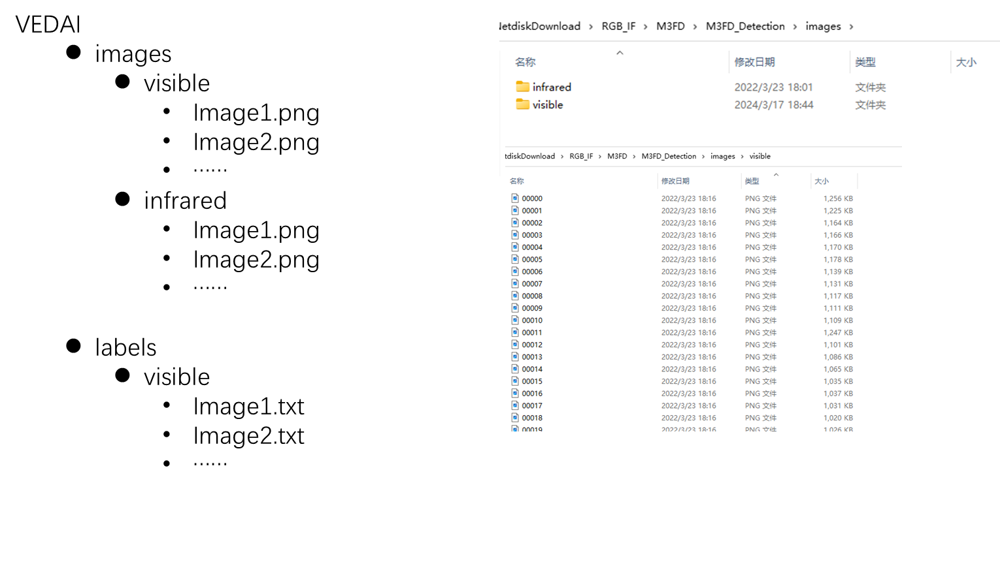
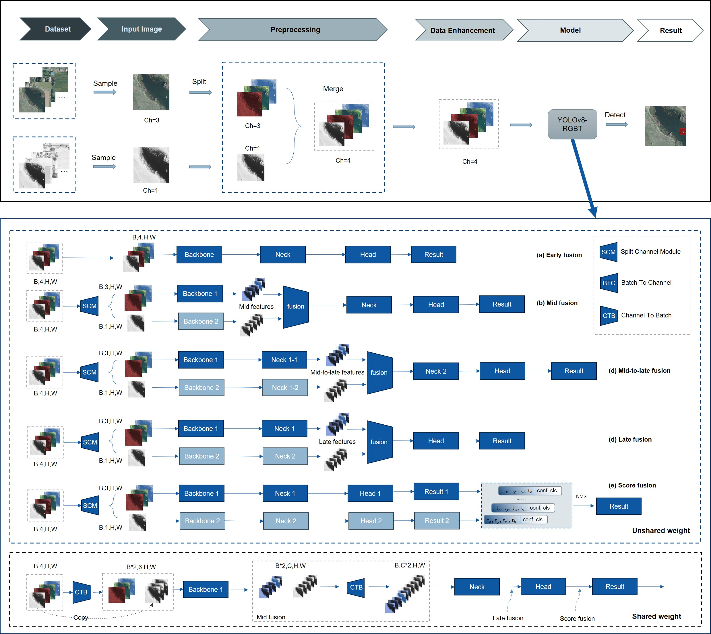

# YOLO-MIF: Improved YOLOv8 with Multi-Information Fusion for Object Detection in Gray-Scale Images

## Introduction
This paper proposes an enhanced object detection network, YOLO-MIF, for addressing the challenges of object detection in gray-scale images. The network integrates multiple multi-information fusion strategies to improve the YOLOv8 network. The paper first introduces a technique for creating pseudo multi-channel gray-scale images to increase the network's channel information and alleviate potential image noise and defocus blur issues. Subsequently, by using network structure reparameterization techniques, the detection performance of the network is improved without increasing the inference time. Additionally, a novel decoupled detection head is introduced to enhance the model's expressive power when dealing with gray-scale images. The algorithm is evaluated on two open-source gray-scale image detection datasets (NEU-DET and FLIR-ADAS). The results show that at the same speed, the algorithm outperforms YOLOv8 by 2.1% and Faster R-CNN by 4.8% in balancing detection efficiency and effectiveness.


## Contributions
1. YOLO-MIF: An object detection network designed for gray-scale images
2. New reparameterization modules: WDBB, RepC2f
3. Rep3C Head
4. GIS: Input strategy for gray-scale images

## Supported image formats:
1. uint8: 'Gray'  Single-channel 8-bit gray-scale image.
2. uint16: 'Gray16bit' Single-channel 16-bit gray-scale image.
3. uint8: 'SimOTM' 'SimOTMBBS'   Single-channel 8-bit gray-scale image TO Three-channel 8-bit gray-scale image.
4. uint8: 'BGR'  Three-channel 8-bit color image.
5. unit8: 'RGBT' Four-channel 8-bit color image.(Including early fusion, middle fusion, late fusion, score fusion, weight sharing mode)

Among them, the directory format of 1-4 is consistent with YOLOv8. With train.txt and val.txt, all you need to do is write the image address below visible, and the data format directory of 'RGBT' is as follows:





## Dataset Configuration

### 1. Dataset Structure
In YOLOv8, the visible light (visible) directory must conform to the dataset configuration principles. Additionally, an infrared (infrared) directory must exist at the same level as the visible light directory. Furthermore, the dataset should be divided into `train` and `val` (optional) subdirectories for training and validation purposes, respectively.

### 2. Configuration Methods
Below are three recommended configuration methods:

#### Important Notes
- Ensure that the visible and infrared directories are at the same level.
- If constructing a YAML file using TXT files, the TXT file paths must include `visible` so that the program can automatically replace it with `infrared`.
- If you encounter issues, please refer to the `load_image` function in `ultralytics/data/base.py`.

---

#### Method 1: Directory Configuration (KAIST Configuration Example)
Store visible and infrared data in directories at the same level, with each modality divided into `train` and `val` subdirectories. The directory structure is as follows:

```
dataset/  # Root directory of the dataset
├── train/  # Store training data
│   ├── visible/  # Data related to visible light images
│   │   ├── images/  # Visible light image files
│   │   └── labels/  # Label files for visible light images (e.g., annotation information)
│   └── infrared/  # Data related to infrared images
│       ├── images/  # Infrared image files
│       └── labels/  # Label files for infrared images (e.g., annotation information)
└── val/  # Store validation data
    ├── visible/  # Data related to visible light images
    │   ├── images/  # Visible light image files
    │   └── labels/  # Label files for visible light images (e.g., annotation information)
    └── infrared/  # Data related to infrared images
        ├── images/  # Infrared image files
        └── labels/  # Label files for infrared images (e.g., annotation information)

---------------------------------------------------------------------

# KAIST.yaml

# train and val data as 1) directory: path/images/
train: dataset/visible/images/train  # 7601 images
val:  dataset/visible/images/val # 2257 images

# number of classes
nc: 1

# class names
names: [ 'person', ]

-----------------------------------------------------------------------
```

- **train/visible**: Stores visible light images and their labels for the training set.
- **train/infrared**: Stores infrared images and their labels for the training set.
- **val/visible**: Stores visible light images and their labels for the validation set.
- **val/infrared**: Stores infrared images and their labels for the validation set.

The program will automatically recognize visible and infrared data through the directory structure.

#### Method 2: Directory Configuration (Configuration Example)
Under the second-level directory, store visible and infrared data in directories at the same level, with each modality divided into `train` and `val` subdirectories. The directory structure is as follows:

```
dataset/
├── images/
│   ├── visible/
│   │   ├── train/  # Store training visible light images
│   │   └── val/    # Store validation visible light images
│   └── infrared/
│       ├── train/  # Store training infrared images
│       └── val/    # Store validation infrared images
└── labels/
    ├── visible/
    │   ├── train/  # Store training visible light image labels
    │   └── val/    # Store validation visible light image labels
    └── infrared/
        ├── train/  # Store training infrared image labels
        └── val/    # Store validation infrared image labels

---------------------------------------------------------------------

# KAIST.yaml

# train and val data as 1) directory: path/images/
train: dataset/images/visible/train  # 7601 images
val:   dataset/images/visible/val # 2257 images

# number of classes
nc: 1

# class names
names: [ 'person', ]

-----------------------------------------------------------------------
```

- **`images/`**: Stores all image data.
  - **`visible/`**: Contains visible light images.
    - **`train/`**: Visible light images for model training.
    - **`val/`**: Visible light images for model validation.
  - **`infrared/`**: Contains infrared images.
    - **`train/`**: Infrared images for model training.
    - **`val/`**: Infrared images for model validation.

- **`labels/`**: Stores all image label information (e.g., annotation files, comments).
  - **`visible/`**: Contains labels for visible light images.
    - **`train/`**: Labels for the training set of visible light images.
    - **`val/`**: Labels for the validation set of visible light images.
  - **`infrared/`**: Contains labels for infrared images.
    - **`train/`**: Labels for the training set of infrared images.
    - **`val/`**: Labels for the validation set of infrared images.

The program will automatically recognize visible and infrared data through the directory structure.

#### Method 3: TXT File Configuration (VEDAI Configuration Example)
Use TXT files to specify data paths. The TXT file content should include visible light image paths, and the program will automatically replace them with the corresponding infrared paths. TXT files need to specify the paths for the training and validation sets (default configuration method for YOLOv5, YOLOv8, YOLOv11).

```
dataset/
├── images/
│   ├── visible/    # Store  visible light images
│   │   ├── image1.jpg  
│   │   └── image2.jpg
│   │   └── ...      
│   └── infrared/  #  Store  visible light images
│       ├── image1.jpg   
│       └── image2.jpg  
│       └── ...         
└── labels/
    ├── visible/  # Store  visible light labels
    │   ├── image1.txt   
    │   └── image2.txt 
    └── infrared/  # Store  infrared light labels
        ├── image1.txt
        └── image2.txt    
        
---------------------------------------------------------------------

# VEDAI.yaml

train:  G:/wan/data/RGBT/VEDAI/VEDAI_train.txt  # 16551 images
val:  G:/wan/data/RGBT/VEDAI/VEDAI_trainval.txt # 4952 images

# number of classes
nc: 9

# class names
names: ['plane', 'boat', 'camping_car', 'car', 'pick-up', 'tractor', 'truck', 'van', 'others']

-----------------------------------------------------------------------
        
```

**Example TXT File Content:**

**train.txt**
```
dataset/images/visible/image1.jpg
dataset/images/visible/image2.jpg
dataset/images/visible/image3.jpg
```

**val.txt**
```
dataset/images/visible/image4.jpg
dataset/images/visible/image5.jpg
dataset/images/visible/image6.jpg
```

The program will replace `visible` with `infrared` in the paths to find the corresponding infrared images.

### 3. Principle Explanation
In the `load_image` function in `ultralytics/data/base.py`, there is a line of code that replaces `visible` with `infrared` in the visible light path. Therefore, as long as there is an infrared directory at the same level as the visible light directory, the program can correctly load the corresponding infrared data.


## Quick Start Guide

### 1. Clone the Project
```bash
git clone https://github.com/wandahangFY/YOLOv11-RGBT.git 
cd YOLOv11-RGBT
```

### 2. Prepare the Dataset
Configure your dataset directory or TXT file according to one of the three methods mentioned above.

### 3. Install Dependencies
```bash
pip install -r requirements.txt
```

### 4. Run the Program
```bash
python train.py --data your_dataset_config.yaml
```
#### Explanation of Training Modes

Below are the Python script files for different training modes included in the project, each targeting specific training needs and data types.

4.1. **`train.py`**
   - Basic training script.
   - Used for standard training processes, suitable for general image classification or detection tasks.

2. **`train-rtdetr.py`**
   - Training script for RTDETR (Real-Time Detection Transformer).

3. **`train_Gray.py`**
   - Grayscale image training script.
   - Specifically for processing datasets of grayscale images, suitable for tasks requiring image analysis in grayscale space.

4. **`train_RGBRGB.py`**
   - RGB-RGB image pair training script.
   - Used for training with two sets of RGB images simultaneously, such as paired training of visible and infrared images, suitable for multimodal image analysis.

5. **`train_RGBT.py`**
   - RGB-T (RGB-Thermal) image pair training script.
   - Used for paired training of RGB images and thermal (infrared) images, suitable for applications requiring the combination of visible light and thermal imaging information.

### 5. Testing
Run the test script to verify if the data loading is correct:
```bash
python val.py
```

---

## Important Notes (Emphasized Again)
- Ensure that the visible and infrared directories are at the same level, and there are `train` and `val` subdirectories under each modality.
- TXT file paths must include `visible` so that the program can automatically replace it with `infrared`.
- If you encounter issues, please refer to the `load_image` function in `ultralytics/data/base.py`.

---
# Dataset Download Links

Here are the Baidu Netdisk links for the converted VEIAI, LLVIP, KAIST, M3FD datasets (you need to change the addresses in the yaml files. If you use txt files to configure yaml files, you need to replace the addresses in the txt files with your own addresses: open with Notepad, Ctrl+H). (Additionally, if you use the above datasets, please correctly cite the original papers. If there is any infringement, please contact the original authors, and it will be removed immediately.)

- VEIAI (Vehicle Detection in Aerial Imagery (VEDAI) : a benchmark (greyc.fr))
- LLVIP (bupt-ai-cz/LLVIP: LLVIP: A Visible-infrared Paired Dataset for Low-light Vision (github.com))
- KAIST
  - Original address (SoonminHwang/rgbt-ped-detection: KAIST Multispectral Pedestrian Detection Benchmark [CVPR '15] (github.com))
  - Download of the complete and cleaned KAIST dataset - kongen - CNBlogs (cnblogs.com)
- M3FD (JinyuanLiu-CV/TarDAL: CVPR 2022 | Target-aware Dual Adversarial Learning and a Multi-scenario Multi-Modality Benchmark to Fuse Infrared and Visible for Object Detection (github.com))

Baidu Netdisk Link:
Link: https://pan.baidu.com/s/1xOUP6UTQMXwgErMASPLj2A Extraction Code: 9rrf


## Contributions
PRs or Issues are welcome to jointly improve the project. This project is a long-term open-source project and will continue to be updated for free in the future, so there is no need to worry about cost issues.

## Contact Information
- GitHub: [https://github.com/wandahangFY](https://github.com/wandahangFY)
- Email: wandahang@foxmail.com
- QQ: 1753205688
- QQ Group: 483264141


<details open>
<summary>Usage</summary>

1. NEU-DET 
```bash
python train_NEU-DET-RepDC.py 

```

2. FLIR-ADAS
```bash
python train_FLIR_ADAS-16-RepDCHead.py

```

</details>

<details open>
<summary>Correspondence between Paper and Code</summary>

1. RIR=True + SimOTMBBS = GIS
- SimOTM yields better results but reduces speed, while the SimOTMBBS used in this paper almost does not reduce speed. If readers need, SimOTM will be open-sourced separately on arXiv without further journal submissions. Original paper and details can be found at: [Link](https://www.researchgate.net/publication/372944004_Otm-Fusion_An_Image_Preprocessing_Method_for_Object_Detection_in_Grayscale_Image)
- Function.cpp contains CUDA and C++ (CPU) implementations
- Code related to GIIS can be found in ultralytics/yolo/data/base.py
- Code related to NEU-DET can be found in train_NEU-DET-RepDC.py
- train-gray.py for single channel training and inference --use_simotm is 'Gray' or 'Gray16bit', channels=1, Model files inside need to set up ch: 1 see ultralytics/models/v8 / yolov8-Gray.yaml
- train_RGBT.py for multi-channel training and inference --use_simotm is 'RGBT', channels=4, In the model file you need to set ch:4 see ultralytics/models/v8-RGBT/yolov8-RGBT-earlyfusion.yaml

```python
parser.add_argument('--use_simotm', type=str, choices=['Gray2BGR', 'SimOTM', 'SimOTMBBS','Gray','SimOTMSSS','Gray16bit','BGR','RGBT'], default='SimOTMBBS', help='simotm')
parser.add_argument('--channels', type=int, default=3, help='input channels')
```
- GIS 


2. Reparameterization Modules

- Code related to WDBB can be found in ultralytics/nn/modules/rep_block.py
```python
['DiverseBranchBlock','DeepACBlockDBB','WideDiverseBranchBlock','DeepDiverseBranchBlock','ACBlockDBB','ACBlock']
# WideDiverseBranchBlock corresponds to WDBB mentioned in the paper, other modules need further experimentation and verification
```
- WDBB 


- DeepDBB (experimental and theoretical details not explained in the paper)


- Code related to RepC2f can be found in ultralytics/nn/modules/block.py
```python
'C2f_ACDBB', 'C2f_DeepACDBB', 'C2f_DeepDBB', 'C2f_DeepACDBBMix', 'C2f_DBB', 'C2f_ACNET', 'C2f_WDBB'

# C2f_WDBB in the code corresponds to RepC2f in the paper, details about C2f_DeepDBB will be used in the next paper. Others need further experimentation and verification
```

- Code related to Rep3C Head can be found in ultralytics/nn/modules/head.py
```python
'Detect', 'Segment', 'Pose', 'Classify', 'RTDETRDecoder','DetectDBB','DetectACDBB','DetectAC','DetectDeepDBB',\
          'DetectDeepACDBB' , 'Detect_Efficient','DetectSingleDBB','Detect2AC2DBB',\
          'Detect2DBB2AC','Detect2DBBAC','Detect2ACDBB','Detect_Efficient3DBB','Detect_Efficient3DBBR'

# Detect_Efficient3DBB in the code corresponds to Rep3C Head in the paper, some modules have been validated effectively but not included in the paper yet. Others need further experimentation and verification
```
- Rep3C Head 


</details>
  

## Chinese Interpretation Link
- [Chinese Interpretation of YOLO-MIF](Chinese Interpretation Link) [TODO: Will be written and updated later if needed]
- [Modified YOLOv8 for RGBT multi-channel and single-channel gray image detection  ](https://zhuanlan.zhihu.com/p/716419187)

## Video Tutorial Link
- [Video Tutorial and Secondary Innovation Solutions for YOLO-MIF]() [TODO: Detailed tutorial in text-based PPT format]

## Secondary Innovation Points Summary and Code Implementation (TODO)
- [Secondary Innovation Solutions]() [The last page of the PPT tutorial provides some secondary innovation solutions. TODO: Will be written and updated later if needed]

## Paper Link
[YOLO-MIF: Improved YOLOv8 with Multi-Information fusion for object detection in Gray-Scale images]( https://www.sciencedirect.com/science/article/pii/S1474034624003574)

[https://www.sciencedirect.com/science/article/pii/S1474034624003574]( https://www.sciencedirect.com/science/article/pii/S1474034624003574)

## Citation Format
Wan, D.; Lu, R.; Hu, B.; Yin, J.; Shen, S.; xu, T.; Lang, X. YOLO-MIF: Improved YOLOv8 with Multi-Information Fusion for Object Detection in Gray-Scale Images. Advanced Engineering Informatics 2024, 62, 102709, doi:10.1016/j.aei.2024.102709.


## Reference Links
- [Codebase used for overall framework: YOLOv8](https://github.com/ultralytics/ultralytics)
- [Reparameterization reference code by Ding Xiaohan: DiverseBranchBlock](https://github.com/DingXiaoH/DiverseBranchBlock)
- [Some modules reference from Devil Mask's open-source repository](https://github.com/z1069614715/objectdetection_script)
- [YOLOv7](https://github.com/WongKinYiu/yolov7)
- [Albumentations Data Augmentation Library](https://github.com/albumentations-team/albumentations)
- Reparameterization validation code references from Handwritten AI's reparameterization course

## Closing Remarks
Thank you for your interest and support in this project. The authors strive to provide the best quality and service, but there is still much room for improvement. If you encounter any issues or have any suggestions, please let us know.
Furthermore, this project is currently maintained by the author personally, so there may be some oversights and errors. If you find any issues, feel free to provide feedback and suggestions.

## Other Open-Source Projects
Other open-source projects are being organized and released gradually. Please check the author's homepage for downloads in the future.
[Homepage](https://github.com/wandahangFY)

## FAQ
1. Added README.md file (Completed)
2. Detailed tutorials (TODO)
3. Project environment setup (The entire project is based on YOLOv8 version as of November 29, 2023, configuration referenced in README-YOLOv8.md file and requirements.txt)
4. Explanation of folder correspondences (Consistent with YOLOv8, hyperparameters unchanged) (TODO: Detailed explanation)
5. Summary of secondary innovation points and code implementation (TODO)
6. Paper illustrations:
   - Principle diagrams, network structure diagrams, flowcharts: PPT (Personal choice, can also use Visio, Edraw, AI, etc.)
   - Experimental comparisons: Orgin (Matlab, Python, R, Excel all applicable)

## Star History

[](https://star-history.com/#wandahangFY/YOLO-MIF&Date)