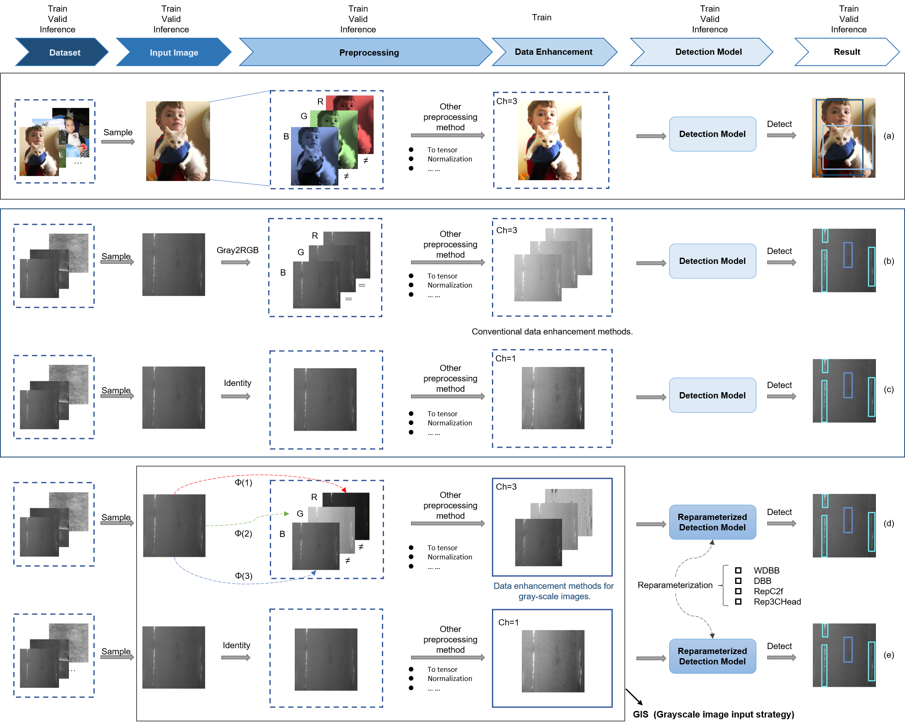

# YOLO-MIF: Improved YOLOv8 with Multi-Information Fusion for Object Detection in Gray-Scale Images


## 简介
本文针对灰度图像中目标检测的挑战，提出了一种增强型目标检测网络YOLO-MIF，该网络整合了多种多信息融合策略，以改进YOLOv8网络。文章首先介绍了一种技术，用于创建伪多通道灰度图像，增加网络的通道信息，并减轻潜在的图像噪声和虚焦模糊问题。随后，采用网络结构重新参数化技术，提升网络的检测性能而不增加推断时间。另外，引入了一种新颖的解耦式检测头，增强了模型在处理灰度图像时的表现力。文章还对该算法在两个开源灰度图像检测数据集（NEU-DET和FLIR-ADAS）上进行了评估。结果表明，在相同速度下，该算法在平衡检测效率和有效性方面优于YOLOv8 2.1％，优于Faster R-CNN 4.8％，取得了更好的性能表现。


## 论文贡献
1. YOLO-MIF ：针对灰度图像设计的目标检测网络
2. 新的重参数化模块：WDBB, RepC2f
3. Rep3C Head
4. GIS：针对灰度图像的输入策略

## 支持图像格式：
1. uint8: 'Gray' 单通道8位灰度图像。
2. uint16: 'Gray16bit' 单通道16位灰度图像。
3. uint8: 'SimOTM' 'SimOTMBBS' 单通道8位灰度图像转换为三通道8位灰度图像。
4. uint8: 'BGR' 三通道8位彩色图像。
5. unit8: 'RGBT' 四通道8位多光谱图像。(包括前期融合，中期融合，后期融合，分数融合，权重共享模式)


其中，1-4的目录格式与YOLOv8保持一致，'RGBT'的数据格式目录如下，如果采用train.txt和val.txt，则只需要写visible下面的图片地址即可：


## 安装
<details open>
<summary>安装</summary>

Pip install the ultralytics package including all [requirements](https://github.com/ultralytics/ultralytics/blob/main/requirements.txt) in a [**Python>=3.7**](https://www.python.org/) environment with [**PyTorch>=1.7**](https://pytorch.org/get-started/locally/).

```bash
pip install -r requirements.txt
```

</details>


<details open>
<summary>使用</summary>

1. NEU-DET 
```bash
python train_NEU-DET-RepDC.py 

```

2. FLIR-ADAS
```bash
python train_FLIR_ADAS-16-RepDCHead.py

```

</details>

<details open>
<summary> 论文与代码对应地方 </summary>

1. RIR=True   +   SimOTMBBS =  GIS
- SimOTM 效果更好，但是会降低速度，本文采用的SimOTMBBS几乎不会降低速度，后续读者有需要的话SimOTM将会单独开源在arXiv，不再投递期刊，原论文和细节见：https://www.researchgate.net/publication/372944004_Otm-Fusion_An_Image_Preprocessing_Method_for_Object_Detection_in_Grayscale_Image
- Function.cpp 为CUDA代码和C++（CPU）实现
- ultralytics/yolo/data/base.py  （代码位于此文件）
- train_NEU-DET-RepDC.py  （调用代码位于此文件）
- train-Gray.py 为单通道训练和推理  --use_simotm 为 'Gray'或者'Gray16bit'， channels=1， 模型文件里面需要设置 ch:1  见 ultralytics/models/v8/yolov8-Gray.yaml
- train_RGBT.py 为多光谱训练和推理  --use_simotm 为 'RGBT'， channels=4，模型文件里面需要设置 ch:4  见 ultralytics/models/v8-RGBT/yolov8-RGBT-earlyfusion.yaml
```python
 parser.add_argument('--use_simotm', type=str, choices=['Gray2BGR', 'SimOTM', 'SimOTMBBS','Gray','SimOTMSSS','Gray16bit','BGR','RGBT'], default='SimOTMBBS', help='simotm')
 parser.add_argument('--channels', type=int, default=3, help='input channels')
```
- GIS 


2. 重参数模块 

- ultralytics/nn/modules/rep_block.py
```python
['DiverseBranchBlock','DeepACBlockDBB','WideDiverseBranchBlock','DeepDiverseBranchBlock','ACBlockDBB','ACBlock']
# WideDiverseBranchBlock 对应论文中 WideDiverseBranchBlock(WDBB),其余模块待做实验验证，需要自取
```
- WDBB 

- DeepDBB(试验和原理并未在文中说明)


- ultralytics/nn/modules/block.py
```python
'C2f_ACDBB', 'C2f_DeepACDBB', 'C2f_DeepDBB', 'C2f_DeepACDBBMix', 'C2f_DBB', 'C2f_ACNET', 'C2f_WDBB'

# 代码中的 C2f_WDBB 对应论文中的  RepC2f ，C2f_DeepDBB及其细节说明将用于下一篇论文，如有使用，请引用github链接或者本论文，其余模块需要自取
```


- ultralytics/nn/modules/head.py
```python
'Detect', 'Segment', 'Pose', 'Classify', 'RTDETRDecoder','DetectDBB','DetectACDBB','DetectAC','DetectDeepDBB',\
          'DetectDeepACDBB' , 'Detect_Efficient','DetectSingleDBB','Detect2AC2DBB',\
          'Detect2DBB2AC','Detect2DBBAC','Detect2ACDBB','Detect_Efficient3DBB','Detect_Efficient3DBBR'

# 代码中的 Detect_Efficient3DBB 对应论文中的Rep3C Head ，部分模块已验证有效果，但是并未加入论文中，其余模块待做实验验证，需要自取
```
- Rep3CHead 


</details>
  


## 中文解读链接
- [YOLO-MIF中文解读](中文解读链接) [TODO: 如有需要，会在后面编写并更新]

## 视频教程链接
- [YOLO-MIF 视频解读和二次创新方案]() [TODO: 文字版PPT详细教程]

## 二次创新点梳理和代码实现（TODO）
- [二次创新方案]() [PPT教程的最后一页提供了部分二次创新方案，TODO: 如有需要，会在后面编写并更新代码]


## 文章链接
[YOLO-MIF: Improved YOLOv8 with Multi-Information fusion for object detection in Gray-Scale images]( https://www.sciencedirect.com/science/article/pii/S1474034624003574)

[https://www.sciencedirect.com/science/article/pii/S1474034624003574]( https://www.sciencedirect.com/science/article/pii/S1474034624003574)

## 引用格式
Wan, D.; Lu, R.; Hu, B.; Yin, J.; Shen, S.; xu, T.; Lang, X. YOLO-MIF: Improved YOLOv8 with Multi-Information Fusion for Object Detection in Gray-Scale Images. Advanced Engineering Informatics 2024, 62, 102709, doi:10.1016/j.aei.2024.102709.


## 参考链接
- [整体框架使用代码：YOLOv8](https://github.com/ultralytics/ultralytics)
- [重参数化参考丁霄汉代码：DiverseBranchBlock](https://github.com/DingXiaoH/DiverseBranchBlock)
- [部分模块参考魔鬼面具 开源主页代码](https://github.com/z1069614715/objectdetection_script)
- [YOLOv7](https://github.com/WongKinYiu/yolov7)
- [Albumentations 数据增强库](https://github.com/albumentations-team/albumentations)
- 重参数化验证部分代码参考 手写AI 的重参数化课程
## 结尾
感谢您对本项目的关注和支持。作者尽力提供最好的质量和服务，但仍然有很多需要改进之处。如果您发现任何问题或有任何建议，请告诉我。
另外，本项目目前由我个人维护，难免存在疏漏和错误。如果您发现了任何问题，欢迎提出建议和意见。

## 其他开源项目
其余开源项目陆续在整理发布，后续请查看作者主页进行下载
[主页](https://github.com/wandahangFY)

## 相关问题解答
1. README.md 文件添加 （已完成）  
2. 详细教程 （TODO）
3. 项目环境配置（整个项目是YOLOv8  2023-11-29当日版本，配置参考README-YOLOv8.md文件和requirements.txt）
4. 文件夹对应说明（与YOLOv8保持一致，未改变超参数）（TODO：详细说明 ）
5. 二次创新点梳理和代码实现（TODO）
6. 论文作图：
   - 原理图，网络结构图，流程图：PPT （根据个人选择，也可以使用Visio，亿图，AI等）
   - 实验对比：Orgin（matlab,python,R,Excel都可以）


## Star History

[](https://star-history.com/#wandahangFY/YOLO-MIF&Date)